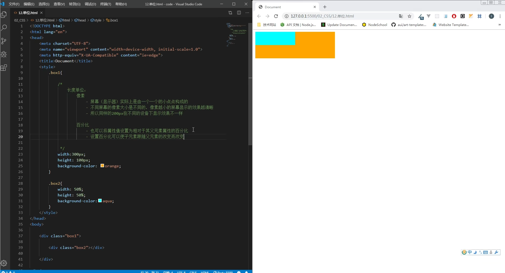
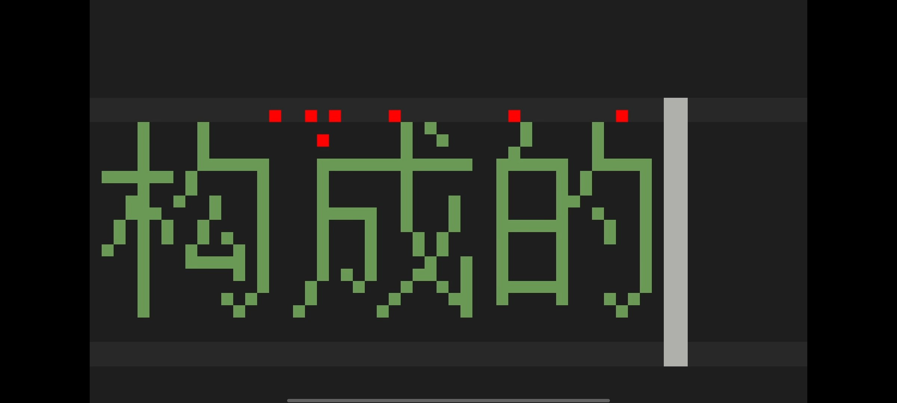
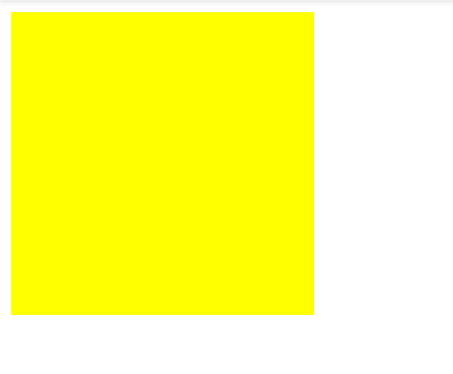
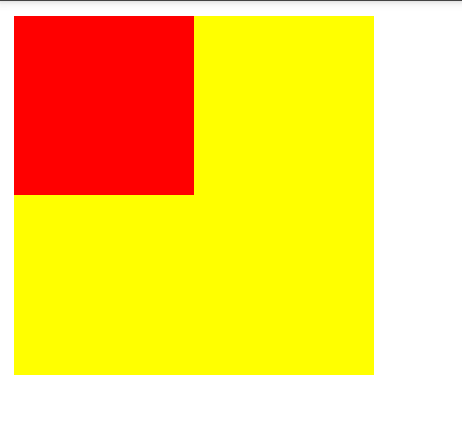

# 前言

> 本文基于[尚硅谷Web前端基础](https://b23.tv/Wky0XJk)教程发布，你也可以理解成这是一篇尚硅谷教程笔记，当然这里也有我的一些经验总结

## 长度单位



### 像素
>px;

像素这个词我们现在听起来可能并不陌生做图片、贴图什么的都需要有像素的存在，可以说我们的整个屏幕都是由一个又一个细小的像素点构成的

但同样的文字在不同的显示器上的像素的大小可能都不一样像素点越小需要的像素就越多，屏幕也就越清晰
```html
<style>
  .box1 {
    width: 200px;
    height: 200px;
    background-color: yellow;
  }
</style>  

<div class="box1"></div>
```
如上。定义一个块填充200像素得到下图

它会随着上面代码的像素的改动而改动这一点不用说，但到不同设备手上可能会因为"高清屏"的改变给你放大125~150不等

### 百分比
> %

先将一个div嵌套在另一个div

```html
<style>
  .box1 {
    width: 200px;
    height: 200px;
    background-color: yellow;
  }
  .box2 {
    width: 50%;
    height: 50%;
    background-color: red;
  }
</style>  

<div class="box1">
<div class="box2">
</div>
</div>
```
大概就是一个这样的效果


修改`box1`的宽高就会发现`box2`也发生了改变，这是因为我们设置了`50%`的缘故，这里的百分比意思是随着父元素的宽高自动适应为父元素的`50%`可以设置为相对于其父元素属性的相对值

### em
> em(原来我经常用的"emm"也是css的一部分)

em是相对元素的字体大小计算的，即会根据字体大小的改变而改变

- 1em=1font-size，即等于一个字体大小(16像素)

### rem
>rem

与em不同的是它是相对于根元素的字体大小来计算，想要改变它需要
```css
  html {
/*在这里更改*/
}
```

# 总结
前两个经常用于图片或块出现的地方，后两个一般都是根据文字的大小做出反应，总之都对[响应式](https://developer.mozilla.org/zh-CN/docs/Learn/CSS/CSS_layout/Responsive_Design)(Responsive design)站点有贡献